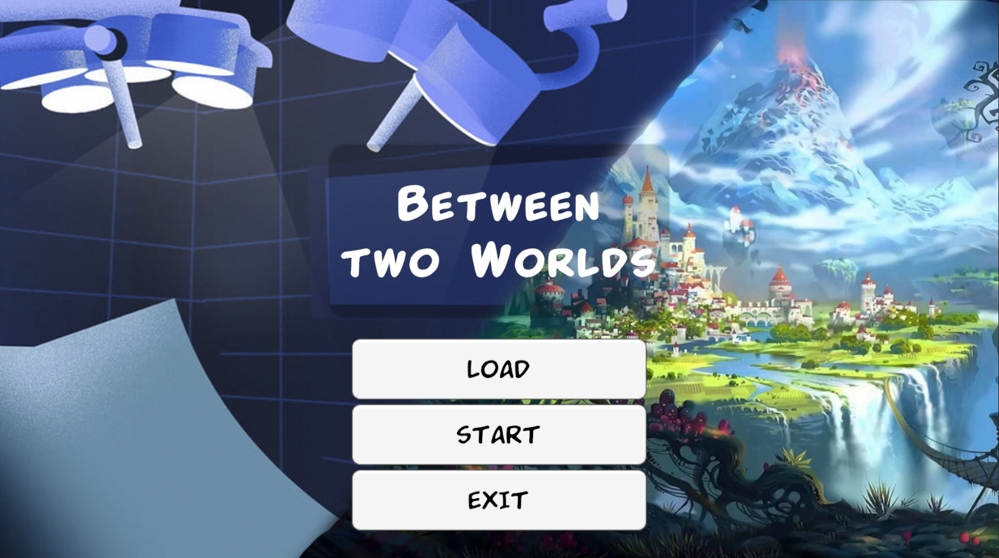
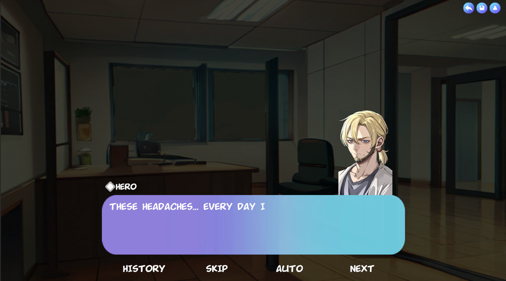
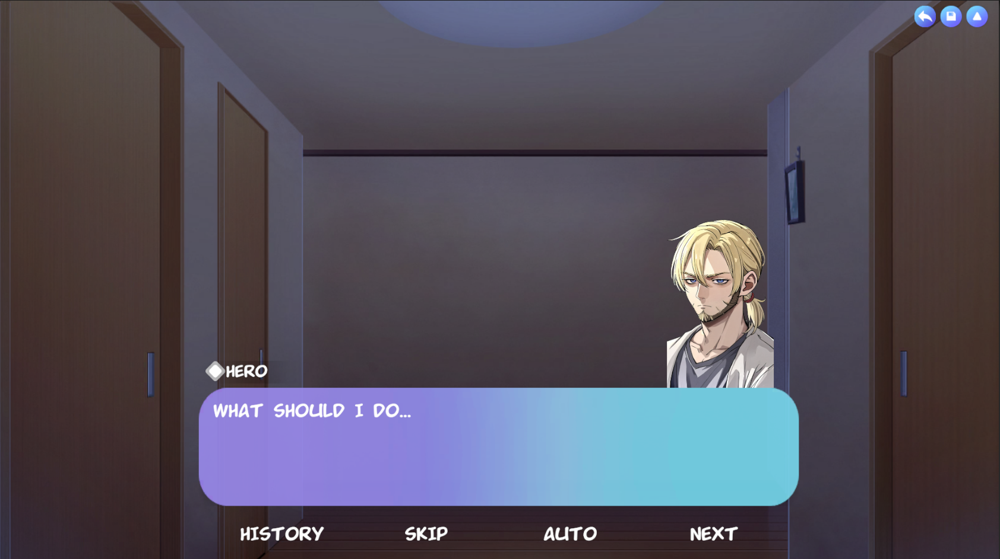
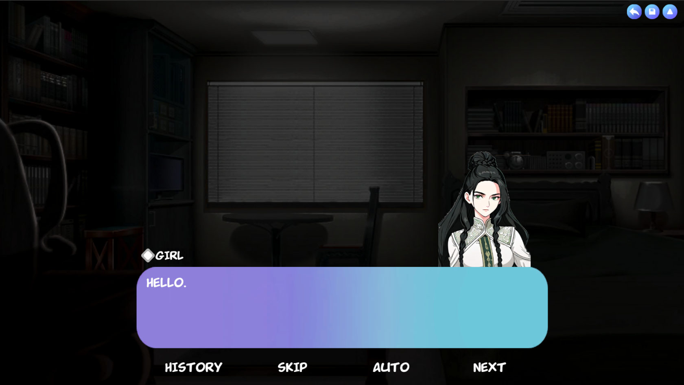
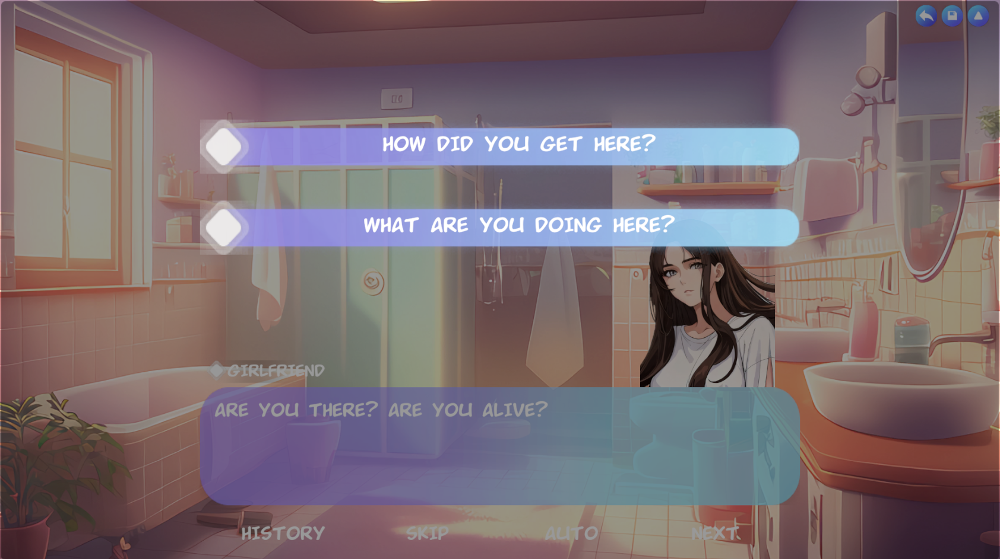

Eng | [Rus](Resources/Localization%20Readme/README_RU.md)

# Between two worlds

## Description

The story, in the form of a visual novel, tells the story of a man standing on the edge of two worlds. He is forced to make a difficult choice between two destinies. What decision will he make? It's up to you.

## Download

You can download the PC version of the [releases](https://github.com/ShutovKS/Between-two-worlds/releases) page.

Web version available [itch.io](https://shutovks.itch.io/between-two-worlds).

Android version available [Google Play](https://play.google.com/store/apps/details?id=com.Forgeofgameworlds.BetweenTwoWorlds) and [apk release](https://github.com/ShutovKS/Between-two-worlds/releases).

## Credits

### Author and developer

- Shutov Kirill (ShutovKS), Russia

#### Link

- [My VK page](https://vk.com/shutovks)
- [My Telegram page](https://t.me/shutovks)
- [Play Market](https://play.google.com/store/apps/developer?id=Forge+of+game+worlds)
- [Itch.io](https://shutovks.itch.io/)
- [GitHub](https://github.com/ShutovKS)

### License

``` text
MIT License
```

## Screenshots

### Main menu



### Gameplay








