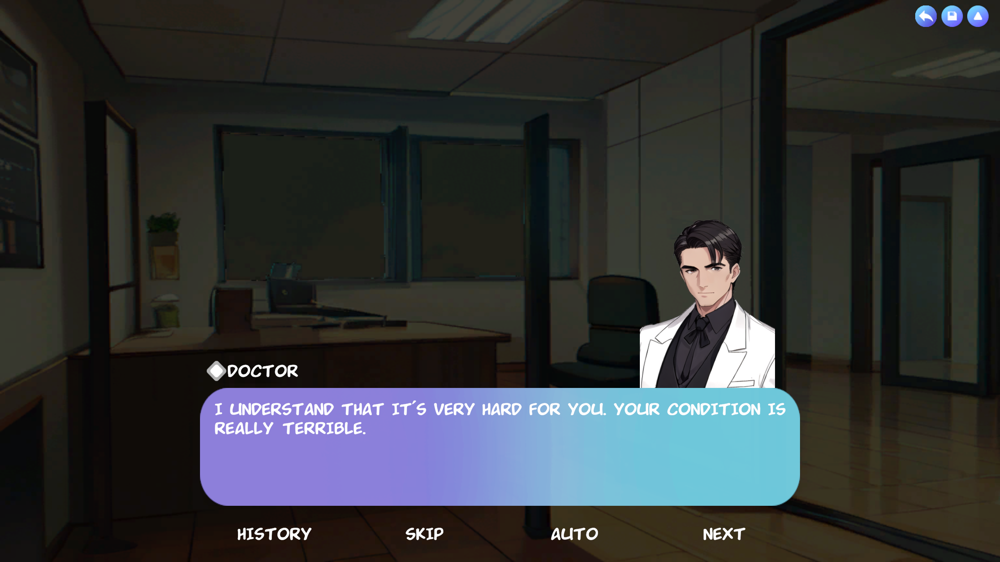
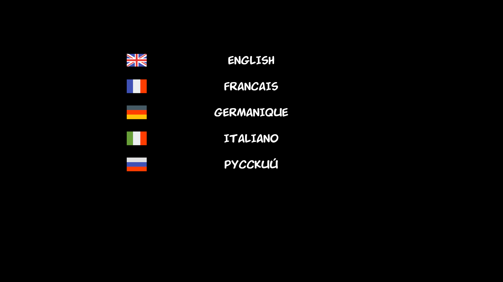

# Between two worlds

Eng | [Rus](resources/localization_readme/README_RU.md)

## Description

The story, in the form of a visual novel, tells the story of a man standing on the edge of two worlds. He is forced to make a difficult choice between two destinies. What decision will he make? It's up to you.

## Download

Games for Windows, Linux, and Android can be downloaded on the [releases](https://github.com/ShutovKS/Between-two-worlds/releases) page or on [itch.io](https://shutovks.itch.io/between-two-worlds).

For access to the web version of the game, please visit [itch.io](https://shutovks.itch.io/between-two-worlds) or [Yandex Games](https://yandex.ru/games/app/292041).

If you are looking for the Android version, it is available in stores [Google Play](https://play.google.com/store/apps/details?id=com.Forgeofgameworlds.BetweenTwoWorlds) and [RuStore](https://apps.rustore.ru/app/com.Forgeofgameworlds.BetweenTwoWorlds).

## Credits

### Author and developer

- Shutov Kirill (ShutovKS), Russia

#### Link

- [My VK page](https://vk.com/shutovks)
- [My Telegram page](https://t.me/shutovks)
- [Play Market](https://play.google.com/store/apps/developer?id=Forge+of+game+worlds)
- [Itch.io](https://shutovks.itch.io/)
- [Yandex Games](https://yandex.ru/games/developer/80013)
- [GitHub](https://github.com/ShutovKS)

### License

``` text
MIT License
```

## screenshots

### Main menu


### Gameplay





### Other



