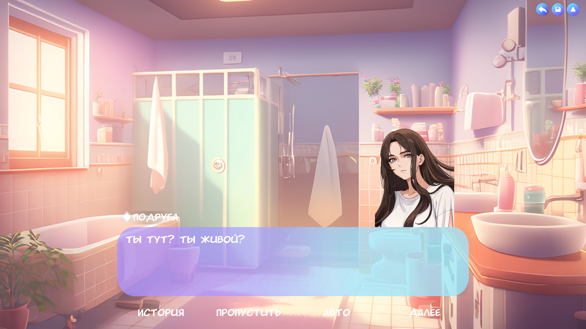
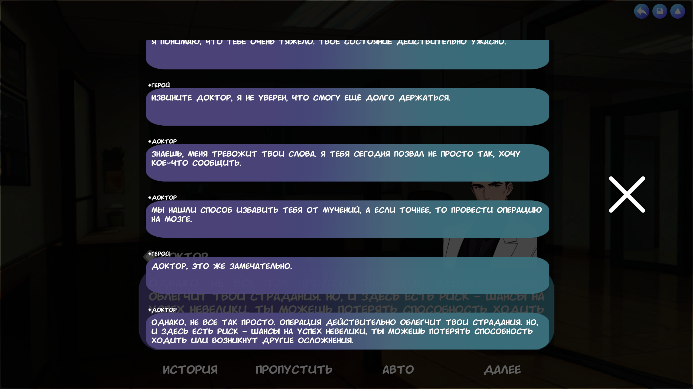

Rus | [Eng](../../README.md)

# Между двух миров

## Описание

История, представленная в форме визуальной новеллы, рассказывает о человеке, стоящем на грани двух миров. Ему приходится принимать трудное решение выбора между двумя судьбами. Какое решение он примет? Решать вам.

## Скачать

Вы можете загрузить версию для ПК на странице [релизов](https://github.com/ShutovKS/Between-two-worlds/releases).

Веб-версия доступна на [itch.io](https://shutovks.itch.io/between-two-worlds).

Версия для Android доступна на [Google Play](https://play.google.com/store/apps/details?id=com.Forgeofgameworlds.BetweenTwoWorlds) и [релиз в формате apk](https://github.com/ShutovKS/Between-two-worlds/releases).

## Авторы

### Автор и разработчик

- Кирилл Шутов (ShutovKS), Россия

#### Ссылки

- [Моя страница VK](https://vk.com/shutovks)
- [Моя страница в Telegram](https://t.me/shutovks)
- [Play Market](https://play.google.com/store/apps/developer?id=Forge+of+game+worlds)
- [Itch.io](https://shutovks.itch.io/)
- [GitHub](https://github.com/ShutovKS)

### Лицензия

``` text
MIT Лицензия
```

## Скриншоты

### Главное меню


### Геймплей




### Прочее




