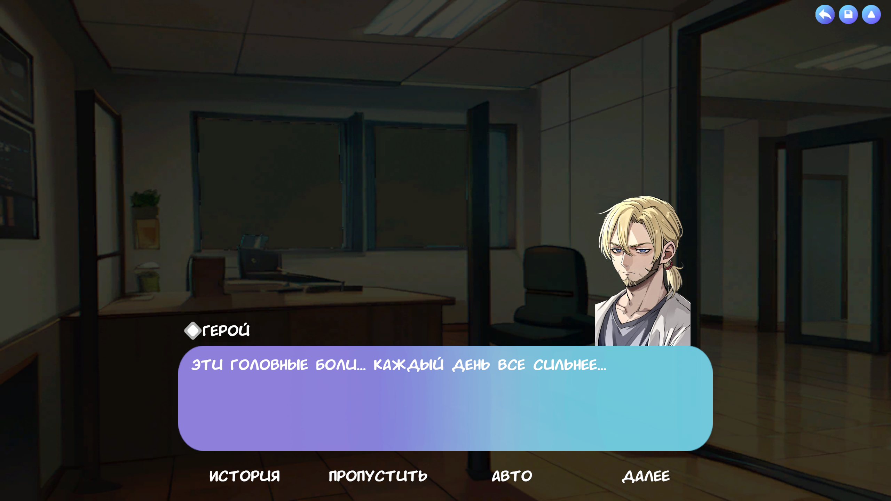
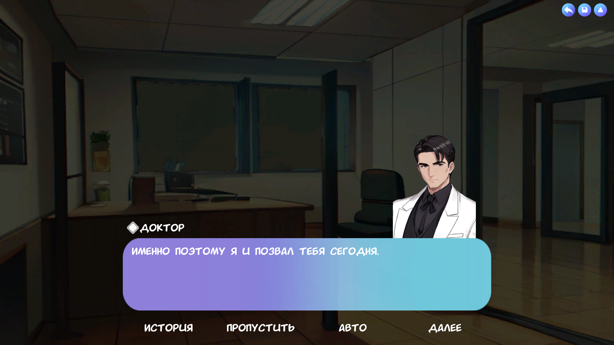
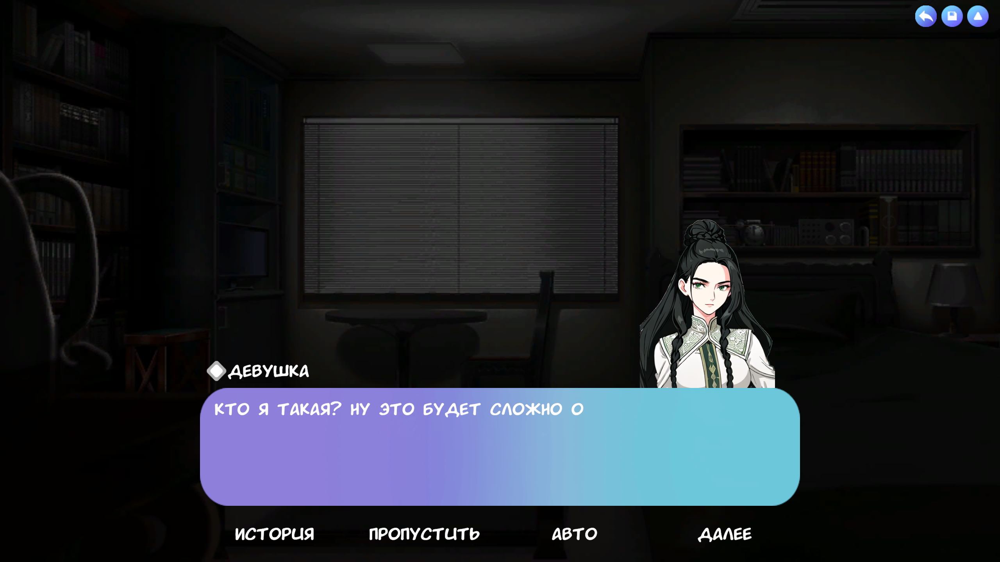
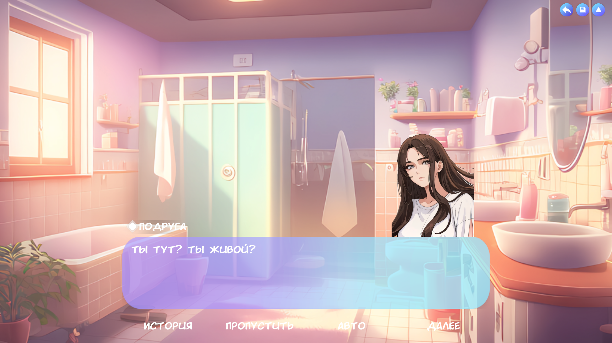
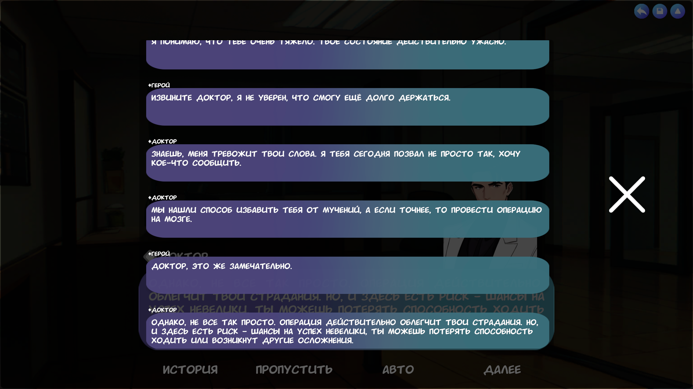
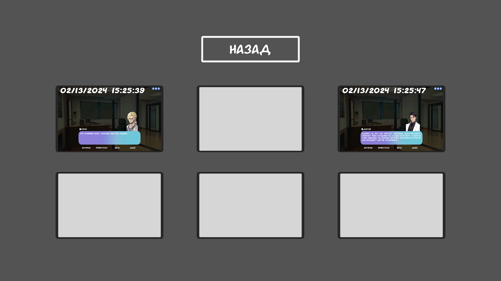
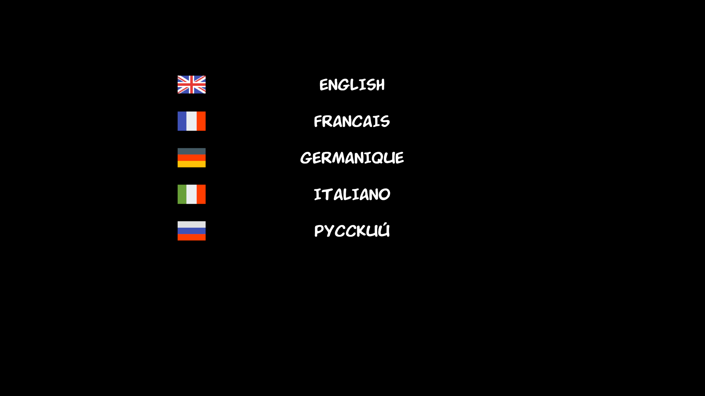

# Между двух миров

Rus | [Eng](../../README.md)

## Описание

История, представленная в форме визуальной новеллы, рассказывает о человеке, стоящем на грани двух миров. Ему приходится принимать трудное решение выбора между двумя судьбами. Какое решение он примет? Решать вам.

## Загрузка

Игры для Windows, Linux и Android можно скачать на странице [релизов](https://github.com/ShutovKS/Between-two-worlds/releases) или на [itch.io](https://shutovks.itch.io/between-two-worlds).

Для доступа к веб-версии игры обратитесь к [itch.io](https://shutovks.itch.io/between-two-worlds), [Yandex Games](https://yandex.ru/games/app/292041), [VK Play](https://mini.vkplay.ru/play/game/between_two_worlds).

Если вы ищете версию для Android, она доступна в сторах [Google Play](https://play.google.com/store/apps/details?id=com.Forgeofgameworlds.BetweenTwoWorlds) и [RuStore](https://apps.rustore.ru/app/com.Forgeofgameworlds.BetweenTwoWorlds).

## Авторы

### Автор и разработчик

- Кирилл Шутов (ShutovKS), Россия

#### Ссылки

- [Моя страница VK](https://vk.com/shutovks)
- [Моя страница в Telegram](https://t.me/shutovks)
- [Play Market](https://play.google.com/store/apps/developer?id=Forge+of+game+worlds)
- [Itch.io](https://shutovks.itch.io/)
- [Yandex Games](https://yandex.ru/games/developer/80013)
- [GitHub](https://github.com/ShutovKS)

### Лицензия

``` text
MIT Лицензия
```

## Скриншоты

### Главное меню


### Геймплей









### Прочее






