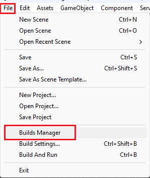
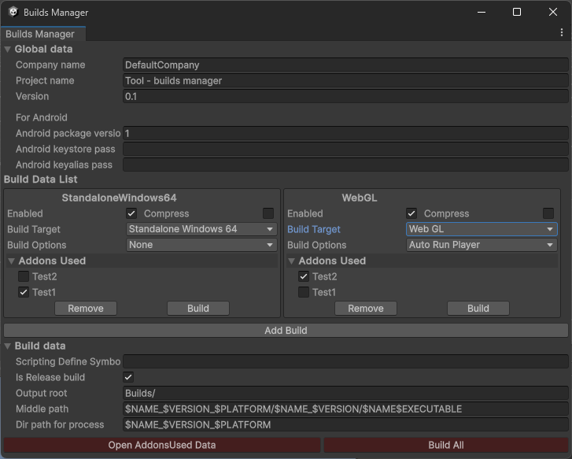
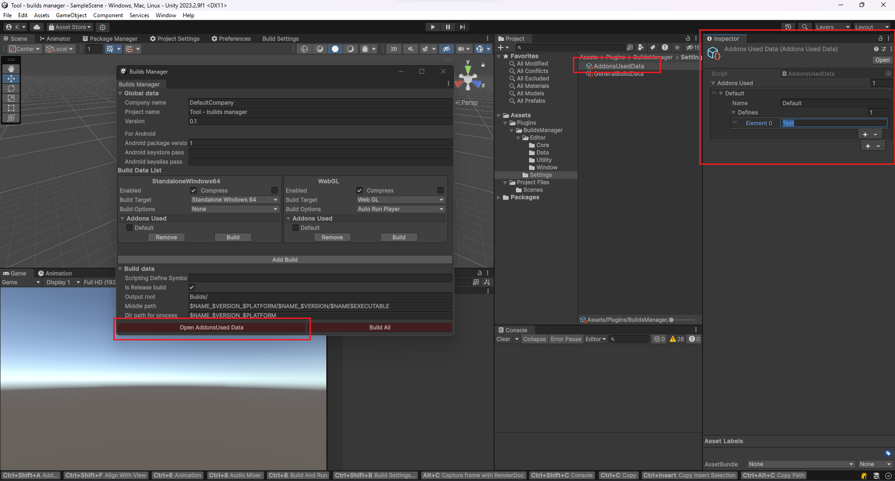

# Менеджер сборок

Rus | [Eng](../../README.md)

## Описание

Инструменнт предназначен для ускорения создания игровых сборок под различные платформы, а так же для того что бы упростить использование различных `Scripting Define Symbols` в разных сборках.

## Руководство

Для открытия менеджера сборок перейдите в `File` -> `Builds Manager`.



В менеджере сборки можно изменять различные данные:

* **Global data** - глобальные данные:
  * **Company name** - название компании;
  * **Product name** - название проекта;
  * **Version** - версия проекта;
  * **Android bundle version** - версия Android пакета;
  * **Android keystore pass** - Android keystore pass;
  * **Android keyalias pass** - Android keyalias pass.
* **Build Data List** - Список настроек экземпляров сборок проекта:
  * **Build list**:
    * **Enabled** - включён/выключен экзмепляр;
    * **Compress** - создать архив .zip;
    * **Build Target** - платформа сборки;
    * **Build Options** - дополнительные настройки;
    * **Addons Used** - используемые дополнения (отображается список, если уже созданы дополнения);
    * **Remove** - удалить текущий экземпляр сборки;
    * **Build** - произвести сборку текущего экземпляра.
  * **Add Build** - добавление нового экземпляра билда в список;
* **Build data** - данные для сборок:
  * **Scripting define symbols** - добавьте дополнительные "Scripting define symbols" для конкретной сборки, будет добавлен к определениям каждой сборки;
  * **Is Release build** - применить оптимизацию выпуска для сборки. Если флажок снят - оптимизирован для более быстрого построения.
  * **Output root** - выходной корневой путь
  * **Middle path** - выведите конкретный путь. Поддержка переменных
  * **Dir path** - путь к каталогу, который будет заархивирован.
* **Open AddonsUsed Data** - кнопка которая показывает ScriptableObject для настройки используемых дополнений;
* **Build All** - создание всех включённых экземпляров сборок проекта.



Список поддерживаемых переменных для пути:

* **$NAME –** название продукта, все разделители которого заменены на '_'
* **$PLATFORM** - платформа
* **$VERSION** - PlayerSettings.bundleVersion
* **$DATESHORT** - [последние 2 цифры года] [месяц] [день]
* **$YEARSHORT** - последние 2 цифры года
* **$DATE** - [год] [месяц] [день]
* **$YEAR** - год
* **$MONTH** - месяц
* **$DAY** - день
* **$TIME** - [час] [минута]
* **$ADDONS** - список названий используемых дополнений в сборке
* **$EXECUTABLE** - исполняемый файл для конкретной платформы. Например. .exe для Windows, .apk для Android...

По нажатию на кнопку `Open AddonsUsed Data` откроется ScriptableObject который нужен для настройкой используемых дополнений.

При нажатии на `+` создаётся дополнение которое хранит внутри себя имя которое отображается в менеджере настроек у экземляра сборки, и используемые `Scripting define symbols` для текущего дополнения.



## Установить

Скачайте и используете .unitypackage из раздела [Releases](https://github.com/ShutovKS/Builds-Manager/releases).

## Информация

### Автор и разработчик

* Shutov Kirill (ShutovKS), Russia

### Лицензия

``` text
MIT License
```
